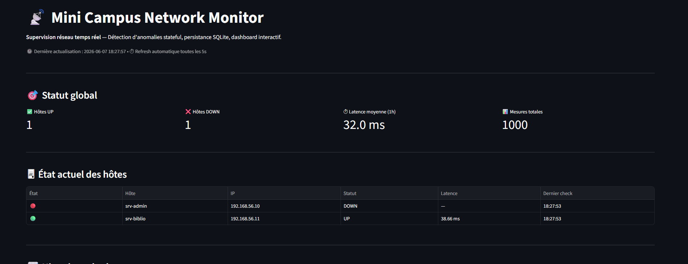
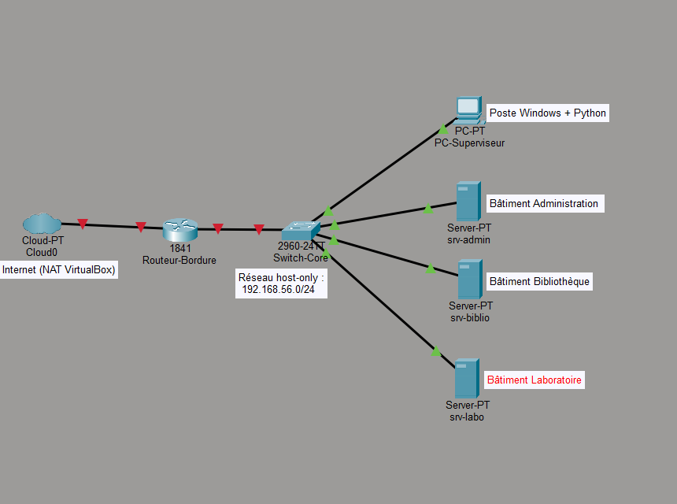

# 📡 Mini Campus Network Monitor

> Plateforme de supervision réseau écrite en Python, qui surveille en temps réel
> un mini-campus simulé : disponibilité des serveurs, latence, détection
> d'anomalies, et alertes — le tout visible dans un dashboard web.



---

## 🎯 Vue d'ensemble

Ce projet reproduit en miniature l'architecture d'outils de supervision
industriels comme **Nagios** ou **Zabbix**. Il a été conçu comme un projet
personnel hors cursus, pour explorer une chaîne technique complète : réseau,
infrastructure virtuelle, code Python modulaire, persistance SQL, et interface
web temps réel.

Le système supervise deux serveurs Linux virtualisés dans VirtualBox,
mesure leur disponibilité et leur latence toutes les 5 secondes, applique des
règles de détection d'anomalies à état, persiste tout l'historique en SQLite,
et expose un dashboard Streamlit avec graphiques interactifs.

---

## ✨ Fonctionnalités clés

- **Supervision active** par ping ICMP avec mesure de latence
- **Détection d'anomalies stateful** (machine à états avec anti-spam)
- **3 types d'alertes** : `HOST_DOWN`, `HOST_RECOVERED`, `HIGH_LATENCY`
- **Double persistance** : CSV (lisible humainement) + SQLite (requêtable)
- **Dashboard temps réel** avec auto-refresh paramétrable et caching
- **Historique des latences** sous forme de graphique interactif Plotly
- **Architecture modulaire** : un fichier = une responsabilité
- **Reproductible** : `pip install` + 1 commande suffit pour tout lancer

---

## 🏗️ Architecture

Le projet repose sur une architecture à **deux mondes parallèles** :

| Monde | Outil | Rôle |
|---|---|---|
| Conception | Cisco Packet Tracer | Topologie visuelle, plan IP, démonstration |
| Opérationnel | VirtualBox + Python | Vraies VMs supervisées en temps réel |

Les deux mondes utilisent **le même plan d'adressage IP** pour assurer la
cohérence entre le schéma théorique et l'infrastructure réelle.



📄 **Détails complets** : voir [`docs/topology.md`](docs/topology.md)

---

## 🛠️ Stack technique

| Couche | Technologie | Rôle |
|---|---|---|
| Infrastructure | VirtualBox + Ubuntu 22.04 LTS | Hébergement des serveurs supervisés |
| Topologie | Cisco Packet Tracer | Modélisation visuelle |
| Langage | Python 3.11+ | Logique métier |
| Persistance | SQLite + CSV | Stockage des mesures et alertes |
| Dashboard | Streamlit + Plotly | Interface web temps réel |
| Manipulation de données | pandas | Transformation et agrégation |
| Versioning | Git + GitHub | Gestion du code source |

---

## 📦 Prérequis

- **Python 3.11 ou supérieur**
- **VirtualBox 7.0+** avec 2 VMs Ubuntu configurées (voir `docs/topology.md`)
- **Cisco Packet Tracer** (optionnel, pour visualiser la topologie)
- **Git**
- **Système d'exploitation** : testé sur Windows 11. Compatible Linux/macOS
  avec adaptation mineure de la commande `ping`.

---

## ⚙️ Installation

### 1. Cloner le dépôt

```bash
git clone https://github.com/Ashraf20i/mini-campus-monitor.git
cd mini-campus-monitor
```

### 2. Créer et activer un environnement virtuel

**Windows (PowerShell)** :
```powershell
python -m venv .venv
.venv\Scripts\Activate.ps1
```

**Linux / macOS** :
```bash
python -m venv .venv
source .venv/bin/activate
```

### 3. Installer les dépendances

```bash
pip install -r requirements.txt
```

### 4. Configurer les VMs cibles

Les hôtes supervisés sont définis dans `src/config.py` :

```python
HOSTS = {
    "srv-admin": "192.168.56.10",
    "srv-biblio": "192.168.56.11",
}
```

Adapte ces IPs à tes propres VMs si besoin. Le plan d'adressage complet est
documenté dans [`docs/topology.md`](docs/topology.md).

---

## 🚀 Lancement

Le projet se lance en **deux processus parallèles** :

### Terminal 1 — Lancer le moteur de supervision

```bash
python -m src.monitor
```

Le script commence à pinger les hôtes toutes les 5 secondes et persiste les
résultats en CSV (`data/metrics.csv`, `data/alerts.csv`) et SQLite
(`data/monitoring.db`).

### Terminal 2 — Lancer le dashboard

```bash
streamlit run dashboard/app.py
```

Le dashboard s'ouvre automatiquement dans le navigateur à
`http://localhost:8501`.

---

## 📁 Structure du projet

```
mini-campus-monitor/
├── README.md                   # Ce fichier
├── LICENSE                     # MIT
├── requirements.txt            # Dépendances Python figées
├── .gitignore
│
├── src/                        # Modules métier
│   ├── __init__.py
│   ├── config.py               # Configuration centralisée (hôtes, seuils)
│   ├── monitor.py              # Boucle de supervision et logging
│   ├── detector.py             # Détecteur d'anomalies (machine à états)
│   └── storage.py              # Persistance SQLite avec context manager
│
├── dashboard/                  # Interface web
│   └── app.py                  # Dashboard Streamlit (4 sections)
│
├── docs/                       # Documentation
│   ├── topology.md             # Plan IP et architecture réseau
│   ├── topology.pkt            # Fichier Packet Tracer
│   ├── topology.png            # Capture de la topologie
│   ├── demo-scenario.md        # Script de démonstration orale
│   └── dashboard-preview.png   # Capture du dashboard
│
├── data/                       # Données runtime (ignoré par Git)
│   ├── metrics.csv
│   ├── alerts.csv
│   └── monitoring.db
│
└── tests/                      # Tests (à enrichir)
```

---

## 🧩 Composants techniques

### `monitor.py` — Le moteur de supervision

Lance une boucle infinie qui ping chaque hôte toutes les 5 secondes via
`subprocess.run`. Mesure la latence aller-retour. Délègue l'évaluation des
mesures au détecteur d'anomalies. Persiste en CSV et en SQLite à chaque
cycle.

### `detector.py` — Le détecteur d'anomalies

Implémente une **machine à états** par hôte, avec 3 règles métier :

- **HOST_DOWN** : 3 échecs consécutifs déclenchent une alerte CRITICAL.
  Le drapeau `down_alert_sent` empêche la ré-émission tant que la panne dure.
- **HOST_RECOVERED** : un retour en UP après une alerte génère un INFO de
  recovery.
- **HIGH_LATENCY** : une latence supérieure au seuil (200 ms par défaut)
  lève un WARNING.

L'état est maintenu en RAM dans un objet unique partagé entre les cycles.

### `storage.py` — La couche de persistance

Encapsule toute la logique SQLite : création des tables, insertion,
lecture, agrégations. Utilise :

- Un **context manager** (`@contextmanager`) pour garantir des transactions
  atomiques avec rollback en cas d'erreur.
- Des **requêtes paramétrées** systématiques pour se protéger contre les
  injections SQL.
- Des **index** sur `host` et `timestamp` pour accélérer les lectures.

### `dashboard/app.py` — Le dashboard Streamlit

4 sections principales :

1. **Statut global** : 3 métriques agrégées (UP, DOWN, latence moyenne).
2. **État actuel des hôtes** : tableau de la dernière mesure par hôte.
3. **Historique des latences** : graphique Plotly multi-séries.
4. **Alertes récentes** : liste des dernières alertes avec sévérité.

Le rafraîchissement automatique utilise `streamlit-autorefresh`. Les
fonctions de lecture SQLite sont mémoïsées avec `@st.cache_data(ttl=2)`
pour fluidifier les interactions utilisateur.

---

## 🎬 Démonstration

Un scénario de démonstration complet est fourni dans
[`docs/demo-scenario.md`](docs/demo-scenario.md). Il décrit en 6 actes
le déroulé d'une présentation orale de 10-12 minutes, avec les points
techniques à souligner, les questions probables, et les réponses préparées.

---

## ⚠️ Limitations connues

Le projet assume volontairement certaines limites pour rester dans le
périmètre d'un MVP démontrable :

- **Mesure de latence imprécise sur Windows** : le ping passe par
  `subprocess.run`, ce qui ajoute un overhead de l'ordre de 10-50 ms.
  Une mesure précise nécessiterait une bibliothèque ICMP native comme
  `pythonping` ou `scapy`.
- **Polling, pas push** : Streamlit utilise du polling par rafraîchissement
  périodique. Pour un push temps réel strict, il faudrait basculer sur
  WebSocket avec FastAPI ou un framework équivalent.
- **État du détecteur en RAM** : si le script `monitor.py` redémarre, l'état
  des compteurs est réinitialisé. Acceptable pour ce périmètre, mais
  imparfait pour un système de production.
- **Pas d'authentification sur le dashboard** : exposé sur `localhost`
  uniquement, ce qui est cohérent avec un usage local.

---

## 🚧 Évolutions prévues

### Court terme

- Intégration du serveur `srv-labo` (`192.168.56.12`) dans la supervision
  active. L'architecture supporte déjà l'ajout, il suffit d'une entrée dans
  `src/config.py`.
- Module de détection d'anomalies de sécurité :
  - Détection de force brute SSH par parsing de `/var/log/auth.log`
  - Détection de port scanning
  - Surveillance d'intégrité des fichiers critiques par hash

### Moyen terme

- Bascule vers une mesure de latence ICMP native (`pythonping`)
- Tests automatisés (`pytest`) sur les modules `detector` et `storage`
- Containerisation avec Docker pour faciliter le déploiement
- Notifications externes (email, webhook Slack/Discord) sur alertes
  CRITICAL

---

## 📚 Documentation supplémentaire

- 📐 [Topologie et plan d'adressage IP](docs/topology.md)
- 🎬 [Scénario de démonstration orale](docs/demo-scenario.md)

---

## 👤 Auteur

**Achraf EL GBOURI** — Élève ingénieur 1ère année à l'EMI (École Mohammadia d'Ingénieurs), Rabat


---

## 📄 Licence

Ce projet est distribué sous licence **MIT** — voir le fichier [`LICENSE`](LICENSE).
